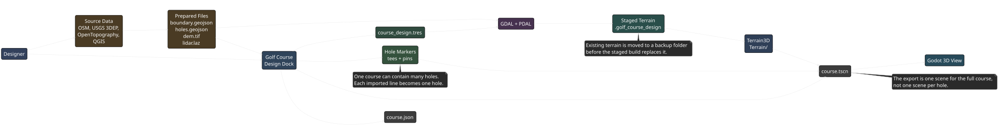

# Golf Course Design

## Table Of Contents
- [Where To Get Course Data](#where-to-get-course-data)
- [Airways Golf Course Example](#airways-golf-course-example)
- [Before You Start](#before-you-start)
- [Set Up The Terrain](#set-up-the-terrain)
  - [Import Real Terrain Data](#import-real-terrain-data)
  - [Manual Terrain Prep](#manual-terrain-prep)
- [Create A New Course](#create-a-new-course)
  - [Import Hole Lines From GeoJSON](#import-hole-lines-from-geojson)
  - [Add Or Edit Holes By Hand](#add-or-edit-holes-by-hand)
- [Export And View The Course](#export-and-view-the-course)
- [What Gets Written To Disk](#what-gets-written-to-disk)
- [Diagram](#diagram)
- [Common Problems](#common-problems)
- [Sources](#sources)

## Where To Get Course Data
Start with public map and elevation data. Do not use private files, paid imagery, or copied course maps unless the license allows it.

| Data | Best starting source | File to save |
| --- | --- | --- |
| Course boundary | OpenStreetMap, local GIS portals, or manual tracing in QGIS | `source_data/<course>_boundary.geojson` |
| Hole center lines | OpenStreetMap `golf=hole`, manual tracing in QGIS, or a prepared GeoJSON file | `source_data/<course>_holes.geojson` |
| Par and yardage | Official course scorecard when available, otherwise a public listing that you verify | Notes in `source_data/` or hole fields in the plugin |
| Elevation raster | USGS 3DEP or OpenTopography | `source_data/<course>_dem.tif` |
| Lidar point cloud | USGS 3DEP lidar or OpenTopography | `source_data/<course>_lidar.laz` |
| Visual overlay | Licensed aerial imagery or a public GIS raster that allows reuse | `source_data/<course>_overlay.tif` |

Useful references:

- OpenStreetMap golf course boundary tag: `leisure=golf_course`
- OpenStreetMap hole line tag: `golf=hole`
- OpenStreetMap pin tag: `golf=pin`
- OpenStreetMap golf route tag: `route=golf`
- USGS The National Map Downloader for DEM and lidar files
- OpenTopography for DEM and lidar files
- TheMapSmith `GeoJSON-GolfCourses` repository for external GeoJSON examples
- Open Course if you want a more structured golf course data model

## Airways Golf Course Example
This is a real-world starter workflow for Airways Golf Course in Fresno, California.

Known public facts to verify before building:

- Course: `Airways Golf Course`
- Address: `5440 E Airways Blvd, Fresno, CA 93727`
- Approximate map center: `36.77724, -119.70619`
- OpenStreetMap boundary candidate: way `42013666`
- Public scorecard reference: 18 holes, par 69, 5301 yards from white tees

Create this working folder:

```text
res://Courses/UserCourses/Airways/
  source_data/
    SOURCES.md
    airways_boundary.geojson
    airways_holes.geojson
    airways_dem.tif
    airways_lidar.laz
    airways_lidar_clipped.laz
    airways_osm_way_42013666.osm
    airways_osm_golf_features.osm
    airways_pins.geojson
    usgs_dem_products.json
    usgs_lidar_products.json
    lidar/
  Terrain/
  course_design.tres
  course.json
  course.tscn
```

Only `course_design.tres`, `Terrain/`, `course.json`, and `course.tscn` are needed by the game. The `source_data/` files are the raw design inputs.

### Step 1: Get The Boundary And Hole Lines
The committed Airways source data was fetched from OpenStreetMap with these commands:

```bash
cd /home/jesher/Code/Github/jeshernandez/OpenShotGolf/Courses/UserCourses/Airways/source_data
curl -L -o airways_osm_way_42013666.osm https://www.openstreetmap.org/api/0.6/way/42013666/full
ogr2ogr -f GeoJSON airways_boundary.geojson airways_osm_way_42013666.osm multipolygons
curl -A OpenShotGolfCourseDesign/1.0 -X POST --data-urlencode 'data=[out:xml][timeout:25];(way(around:1200,36.77724,-119.70619)["golf"="hole"];relation(around:1200,36.77724,-119.70619)["route"="golf"];node(around:1200,36.77724,-119.70619)["golf"="pin"];);out body;>;out skel qt;' -o airways_osm_golf_features.osm https://overpass-api.de/api/interpreter
OSM_USE_CUSTOM_INDEXING=NO ogr2ogr -f GeoJSON /tmp/airways_holes_raw.geojson airways_osm_golf_features.osm lines
jq '.name="airways_holes" | .features |= map(.properties += {golf:"hole", ref: ((try (.properties.other_tags | capture("\\"ref\\"=>\\"(?<v>[^\\"]+)\\"").v) catch "")), par: ((try (.properties.other_tags | capture("\\"par\\"=>\\"(?<v>[^\\"]+)\\"").v | tonumber) catch null))} | .properties.name = ("Hole " + .properties.ref)) | .features |= sort_by(.properties.ref | tonumber)' /tmp/airways_holes_raw.geojson > airways_holes.geojson
ogr2ogr -f GeoJSON airways_pins.geojson airways_osm_golf_features.osm points
```

This produces:

- `airways_boundary.geojson`: one course boundary polygon.
- `airways_holes.geojson`: 18 OSM hole lines with `ref`, `name`, and `par`.
- `airways_pins.geojson`: an empty GeoJSON result because no OSM `golf=pin` points were found.

If you prefer Overpass Turbo, run this query and export the result:

```text
[out:json][timeout:25];
(
  way(around:1200,36.77724,-119.70619)["leisure"="golf_course"];
  relation(around:1200,36.77724,-119.70619)["leisure"="golf_course"];
  way(around:1200,36.77724,-119.70619)["golf"="hole"];
  relation(around:1200,36.77724,-119.70619)["route"="golf"];
);
out body geom;
```

If OSM does not have complete hole lines, create `airways_holes.geojson` in QGIS. Draw one `LineString` per hole. Put the tee at the first point and the green or pin at the last point. Add these properties to each line:

```text
ref=1
name=Hole 1
par=4
```

### Step 2: Get Elevation
The committed Airways DEM was fetched from USGS 3DEP and cropped with GDAL:

```bash
cd /home/jesher/Code/Github/jeshernandez/OpenShotGolf/Courses/UserCourses/Airways/source_data
curl -L -o usgs_dem_products.json 'https://tnmaccess.nationalmap.gov/api/v1/products?datasets=Digital%20Elevation%20Model%20%28DEM%29%201%20meter&bbox=-119.712,36.774,-119.701,36.781&prodFormats=GeoTIFF&outputFormat=JSON'
gdalwarp -overwrite -r bilinear -cutline airways_boundary.geojson -crop_to_cutline -dstnodata -9999 -t_srs EPSG:26911 -tr 1 1 /vsicurl/https://prd-tnm.s3.amazonaws.com/StagedProducts/Elevation/1m/Projects/CA_SanJoaquin_2021_A21/TIFF/USGS_1M_11_x25y408_CA_SanJoaquin_2021_A21.tif airways_dem.tif
gdalinfo -stats airways_dem.tif
```

The resulting `airways_dem.tif` is `932 x 610` pixels at 1 meter resolution in `EPSG:26911`.

Optional point cloud path:

The committed Airways lidar data was fetched from USGS 3DEP and prepared with PDAL:

```bash
cd /home/jesher/Code/Github/jeshernandez/OpenShotGolf/Courses/UserCourses/Airways/source_data
mkdir -p lidar
curl -L -o usgs_lidar_products.json 'https://tnmaccess.nationalmap.gov/api/v1/products?datasets=Lidar%20Point%20Cloud%20%28LPC%29&bbox=-119.712,36.774,-119.701,36.781&outputFormat=JSON'
curl -L --connect-timeout 10 --max-time 120 --retry 3 --speed-limit 1024 --speed-time 15 -o lidar/USGS_LPC_CA_FEMAR9Fresno_2019_D20_11SKA570730.laz https://rockyweb.usgs.gov/vdelivery/Datasets/Staged/Elevation/LPC/Projects/CA_FEMAR9Fresno_2019_D20/CA_FEMAR9Fresno_2_2019/LAZ/USGS_LPC_CA_FEMAR9Fresno_2019_D20_11SKA570730.laz
curl -L --connect-timeout 10 --max-time 120 --retry 3 --speed-limit 1024 --speed-time 15 -o lidar/USGS_LPC_CA_FEMAR9Fresno_2019_D20_11SKA570740.laz https://rockyweb.usgs.gov/vdelivery/Datasets/Staged/Elevation/LPC/Projects/CA_FEMAR9Fresno_2019_D20/CA_FEMAR9Fresno_2_2019/LAZ/USGS_LPC_CA_FEMAR9Fresno_2019_D20_11SKA570740.laz
curl -L --connect-timeout 10 --max-time 120 --retry 3 --speed-limit 1024 --speed-time 15 -o lidar/USGS_LPC_CA_FEMAR9Fresno_2019_D20_11SKA580730.laz https://rockyweb.usgs.gov/vdelivery/Datasets/Staged/Elevation/LPC/Projects/CA_FEMAR9Fresno_2019_D20/CA_FEMAR9Fresno_2_2019/LAZ/USGS_LPC_CA_FEMAR9Fresno_2019_D20_11SKA580730.laz
curl -L --connect-timeout 10 --max-time 120 --retry 3 --speed-limit 1024 --speed-time 15 -o lidar/USGS_LPC_CA_FEMAR9Fresno_2019_D20_11SKA580740.laz https://rockyweb.usgs.gov/vdelivery/Datasets/Staged/Elevation/LPC/Projects/CA_FEMAR9Fresno_2019_D20/CA_FEMAR9Fresno_2_2019/LAZ/USGS_LPC_CA_FEMAR9Fresno_2019_D20_11SKA580740.laz
pdal merge lidar/USGS_LPC_CA_FEMAR9Fresno_2019_D20_11SKA570730.laz lidar/USGS_LPC_CA_FEMAR9Fresno_2019_D20_11SKA570740.laz lidar/USGS_LPC_CA_FEMAR9Fresno_2019_D20_11SKA580730.laz lidar/USGS_LPC_CA_FEMAR9Fresno_2019_D20_11SKA580740.laz airways_lidar.laz
pdal translate airways_lidar.laz airways_lidar_clipped.laz crop --filters.crop.bounds="([258023.64,258955.64],[4073279.48,4073889.48])"
pdal info --summary airways_lidar_clipped.laz
```

Use `airways_lidar_clipped.laz` in the plugin unless you specifically need the full merged `airways_lidar.laz`.

### Step 3: Prepare The Data
Use QGIS or command-line GDAL before importing if the files do not line up.

1. Load `airways_boundary.geojson`, `airways_holes.geojson`, and `airways_dem.tif`.
2. Reproject working layers to a local meter-based CRS. For Fresno, use `EPSG:26911` or `EPSG:32611`.
3. Buffer the course boundary by `50` to `200` meters so the terrain includes edges, trees, and nearby roads.
4. Clip the DEM to the buffered boundary.
5. Fill no-data holes if the DEM has gaps.
6. Smooth only small artifacts. Do not flatten greens, fairways, or hazard edges unless you mean to redesign the course.
7. If you use a color overlay, align it to the same extent and resolution as the DEM.
8. Verify every hole line starts at a tee and ends at a green.
9. Save any edited hole lines back to `airways_holes.geojson`.

Manual cleanup is expected. Real course data rarely imports perfectly on the first pass.

## Before You Start
1. Open the project in the Godot `.NET` editor.
2. Wait for the C# scripts to finish compiling.
3. Make sure the `Terrain3D` addon is enabled.
4. Open the bottom panel named `Golf Course Design`.
5. Create or choose the final output folder before building terrain.
6. Install GDAL if you want heightmap import.
7. Install PDAL if you want point cloud import.

The local machine used for the Airways data had GDAL `3.10.3` and PDAL `2.10.0` available.

## Set Up The Terrain
The terrain step creates or copies the `Terrain/` folder used by Terrain3D.

1. Open the `Import` tab.
2. Set `Import mode`.
3. Set `Output folder` on the `Course` tab before building terrain.
4. Leave `Terrain folder` as `Terrain` unless this course needs a different folder name.
5. Click `Build terrain` only when you are ready to update the Terrain3D folder.

Terrain builds are now staged first. If an existing `Terrain/` folder is replaced, the old folder is moved to a timestamped backup folder next to it.

### Import Real Terrain Data
Use this path for DEM, GeoTIFF, or lidar data.

For DEM or GeoTIFF:

1. Set `Import mode` to `Heightmap`.
2. Set `Source heightmap` to `res://Courses/UserCourses/Airways/source_data/airways_dem.tif`.
3. Set `Source boundary` to `res://Courses/UserCourses/Airways/source_data/airways_boundary.geojson` if you want GDAL to clip the DEM.
4. Set `Source overlay` only if you have a licensed raster overlay.
5. Set `GDAL translate command` to `gdal_translate` or the full path.
6. Set `GDAL warp command` to `gdalwarp` or the full path.
7. Set `Source CRS` only if GDAL cannot read it from the file.
8. Set `Target CRS` to `EPSG:26911` or `EPSG:32611` for the Airways example.
9. Set `Raster resolution (m)` to `1.0` as a starting point.
10. Set `Terrain height scale` to `1.0` as a starting point.
11. Set `Terrain height offset` to `0.0` as a starting point.
12. Click `Build terrain`.

For LAS or LAZ point clouds:

1. Set `Import mode` to `Point cloud`.
2. Set `Source point cloud` to `res://Courses/UserCourses/Airways/source_data/airways_lidar_clipped.laz`.
3. Set `PDAL command` to `pdal` or the full path.
4. Set `Target CRS` to the same CRS you use for the course.
5. Click `Build terrain`.

The point cloud path writes a temporary PDAL pipeline in `.golf_course_design/`, creates a raster heightmap, then imports it through Terrain3D.

### Manual Terrain Prep
Use this path when you already have a Terrain3D folder.

1. Set `Import mode` to `External terrain data`.
2. Set `Source terrain directory` to another Terrain3D folder.
3. Keep `Copy source terrain data into the exported course folder` enabled if the new course should own its own copy.
4. Turn that checkbox off if you only want the plugin to leave the existing `Terrain/` folder untouched.
5. Click `Build terrain`.

## Create A New Course
After terrain exists, create the playable course data.

1. Click `New project`.
2. Set `Project file` to `res://Courses/UserCourses/Airways/course_design.tres`.
3. Set `Course title` to `Airways`.
4. Set `Output folder` to `res://Courses/UserCourses/Airways`.
5. Set `Terrain folder` to `Terrain`.
6. Save the project.

### Import Hole Lines From GeoJSON
Use this when you have `airways_holes.geojson`.

1. Open the `Import` tab.
2. Set `Source holes GeoJSON` to `res://Courses/UserCourses/Airways/source_data/airways_holes.geojson`.
3. Leave `Origin latitude` and `Origin longitude` as `0` if you want the importer to use the first hole coordinate as the origin.
4. Set `Meters to Godot scale` to `1.0` for one Godot unit per meter.
5. Click `Import holes GeoJSON`.
6. Review the imported holes on the `Course` tab.
7. Click `Save`.

The importer reads `LineString` and `MultiLineString` features. The first point becomes the tee position. The last point becomes the hole location. All tee colors start at the same imported tee point, so adjust individual tee boxes by hand afterward.

The importer expects GeoJSON coordinates in longitude and latitude. If your hole file is already projected in meters, convert it back to `EPSG:4326` before using this button.

### Add Or Edit Holes By Hand
Use this when no clean hole GeoJSON exists, or after importing rough hole lines.

1. Open the `Course` tab.
2. Click `Add` to create a hole.
3. Set `Hole name`.
4. Set `Par`.
5. Set `Hole location X` and `Z`.
6. Set the tee box X and Z values for Black, Blue, White, and Red.
7. Use `Duplicate` when the next hole should start from similar values.
8. Use `Remove` to delete the selected hole.
9. Repeat until every hole is entered.

For real courses, use QGIS or the Godot 3D view as the reference while adjusting positions.

## Export And View The Course
1. Click `Save`.
2. Click `Build terrain` if the Terrain3D folder has not been created yet.
3. Click `Export course`.
4. Click `Open scene` to load `course.tscn` in the Godot editor.
5. Inspect the Terrain3D node in the 3D viewport.
6. Check the `HoleMarkers` node to verify pins and tees.
7. Use Terrain3D tools to paint, sculpt, or repair terrain details.
8. Run the game and select the course from the course selector.

Yes, the course can be viewed in the Godot 3D viewer. The current preview path opens the exported scene. It does not yet auto-position the editor camera or draw full fairway and green meshes.

## What Gets Written To Disk
A finished course folder usually looks like this:

```text
res://Courses/UserCourses/Airways/
  course.json
  course.tscn
  Terrain/
  course_design.tres
  source_data/
```

Each file has a different job:

- `course.tscn` is one playable Godot scene for the whole course.
- `course.json` is the course metadata the current loader expects.
- `Terrain/` contains the Terrain3D region files.
- `course_design.tres` is the editable plugin project file.
- `source_data/` is optional raw design data and is not loaded by the game.

The addon does not create one scene per hole. You add or import holes one at a time, but they are stored in one course project and exported into one course scene.

Temporary import files are written to:

```text
res://Courses/UserCourses/Airways/.golf_course_design/
```

If terrain is rebuilt over an existing `Terrain/` folder, the old folder is moved to a backup path like:

```text
res://Courses/UserCourses/Airways/Terrain.backup-20260528153000/
```

## Diagram
The source diagram is in [assets/course_pipeline.puml](assets/course_pipeline.puml), and the rendered images are in [assets/course_pipeline.svg](assets/course_pipeline.svg) and [assets/course_pipeline.png](assets/course_pipeline.png).



## Common Problems
- If `pdal` fails, install PDAL or set `PDAL command` to the full executable path.
- If GDAL fails to clip terrain, confirm the DEM and boundary use compatible CRS values.
- If imported holes are far away from the terrain, check the origin latitude, origin longitude, and whether the GeoJSON is longitude/latitude.
- If terrain looks too flat or too tall, adjust `Terrain height scale` and rebuild terrain.
- If a course does not appear in the selector, confirm that both `course.json` and `course.tscn` exist.
- If `Open scene` does nothing, export the course first and check the Godot Output panel.

## Sources
- Airways Golf Course: https://airways.golf/course-details/
- Airways FAQ: https://airways.golf/faqs-airways-golf-course/
- Airways map listing: https://mapcarta.com/23047558
- Airways scorecard reference: https://www.golflink.com/golf-courses/ca/fresno/airways-golf-course
- OpenStreetMap golf course tag: https://wiki.openstreetmap.org/wiki/Tag:leisure%3Dgolf_course
- OpenStreetMap golf hole tag: https://wiki.openstreetmap.org/wiki/Tag:golf%3Dhole
- OpenStreetMap golf pin tag: https://wiki.openstreetmap.org/wiki/Tag:golf%3Dpin
- OpenStreetMap golf route tag: https://wiki.openstreetmap.org/wiki/Tag:route%3Dgolf
- USGS 3DEP: https://www.usgs.gov/3DEP
- USGS The National Map data downloads: https://www.usgs.gov/the-national-map-data-delivery/gis-data-download
- OpenTopography: https://www.opentopography.org/
- GDAL `gdal_translate`: https://gdal.org/en/stable/programs/gdal_translate.html
- GDAL `gdalwarp`: https://gdal.org/en/stable/programs/gdalwarp.html
- PDAL `writers.gdal`: https://pdal.io/en/stable/stages/writers.gdal.html
- PDAL reprojection filter: https://pdal.io/en/stable/stages/filters.reprojection.html
- GeoJSON golf course examples: https://github.com/TheMapSmith/GeoJSON-GolfCourses
- Open Course model reference: https://opensourcegolf.com/open-course.html
- Godot geospatial reference plugin: https://github.com/boku-ilen/geodot-plugin
